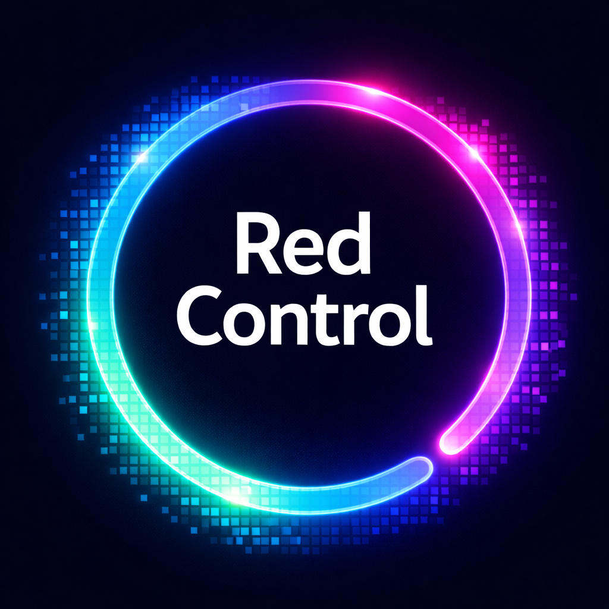
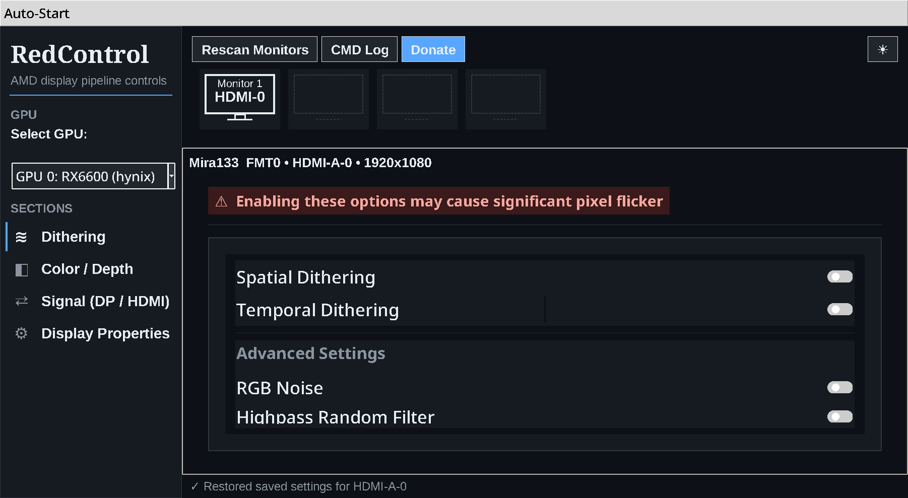

# RedControl

<p align="center">
  
</p>

**Low-level dithering & DisplayPort signal control for AMD GPUs on Linux**


RedControl talks directly to the AMD display engine (DCN) through UMR — the User Mode Register debugger — to control things no desktop settings panel exposes: per-pipe spatial/temporal dithering, color truncation, and as of v2.1 the DisplayPort stream encoder itself. Built for flicker-sensitive users, display tinkerers, and anyone who needs to know (and change) exactly what signal their AMD GPU is putting on the wire.

## Screenshots



## Quick install

```bash
git clone <this-repo-url> RedControl && cd RedControl
./install.sh
```

`install.sh` verifies Python/Tkinter, installs **umr** (the one required dependency) for your distro — or builds it from source — adds an app-menu launcher, and offers to launch. Prefer to do it by hand? See [Requirements](#requirements).

## Features

- 🎛️ **Dithering Control** — enable/disable spatial and temporal dithering, RGB noise, highpass/frame random, with per-depth and per-mode settings on every output (HDMI, DisplayPort, eDP, DVI)
- ✂️ **Color Truncation** — force a static signal by truncating/rounding to 6/8/10/12 bpc instead of dithering
- ⇄ **Signal panel (new in 2.1)** — live view of the DIG encoder driving each output: link type (DisplayPort, HDMI, or HDMI-over-DP++), pixel encoding (RGB/YCbCr) and the color depth actually on the wire. Force `DP_COMPONENT_DEPTH` (DP, 6–16 bpc) or `HDMI_DEEP_COLOR_DEPTH` (HDMI, 8–16 bpc) instantly — no modeset required; HDMI changes auto-revert in 15 s unless confirmed
- 🎨 **Color / Depth** — max bpc, colorspace (BT.709/opRGB/BT.2020), RGB range (full/limited) per connector
- 🖥️ **Multi-Monitor** — CRTC-based pipe mapping; each display configured independently
- 🎮 **Multi-GPU** — automatic detection and switching between AMD GPUs
- 🔄 **Settings Persistence** — per-monitor auto-save/restore
- ⏱️ **Safe Mode Changes** — resolution/refresh changes ask for confirmation and auto-revert after 15 s if the screen goes blank
- 💾 **VRAM Vendor Detection** — Samsung / Hynix / Micron shown next to the GPU name
- 🚀 **System Tray** — minimize to tray with quick actions
- 📋 **Command Log** — every register write is logged as the exact `umr` command, so you can reproduce or script anything the GUI does

## Why control dithering?

AMD's driver enables temporal dithering in situations where it can cause visible flicker, eye strain, or headaches for sensitive users — and there is no official switch to turn it off on Linux. RedControl gives you that switch, per output, at the register level, plus the DisplayPort-side depth control to pair with it (e.g. force a clean static 8 bpc signal with no dithering at all).

## Supported AMD GPUs

All AMD GPUs with a DCN (Display Core Next) display engine:

- **RDNA 1**: Navi 10, 12, 14 (RX 5000 series)
- **RDNA 2**: Navi 21, 22, 23, 24 (RX 6000 series)
- **RDNA 3**: Navi 31, 32, 33 (RX 7000 series)
- **APUs**: Renoir, Cezanne, Rembrandt, Phoenix (Ryzen 4000–7000 integrated graphics)

## Requirements

- Linux with the `amdgpu` driver (X11 session recommended; core dithering + DP signal features also work on Wayland)
- Python 3 with Tkinter
- [UMR](https://gitlab.freedesktop.org/tomstdenis/umr) (User Mode Register debugger)
- Optional: `python3-pil`, `pystray` (tray icon), `vulkan-tools` (better GPU names)

### Installing UMR

```bash
# Arch Linux
yay -S umr-git

# Ubuntu/Debian
sudo apt install umr

# From source
git clone https://gitlab.freedesktop.org/tomstdenis/umr.git
cd umr && mkdir build && cd build
cmake .. && make && sudo make install
```

## Usage

```bash
python3 redcontrol.py            # normal launch
python3 redcontrol.py --tray     # start in system tray
python3 redcontrol.py --debug    # verbose console output
```

Run as a normal user — UMR calls go through `sudo`, and the app can set up passwordless access for the exact commands it needs (menu: Auto-Start → Passwordless Access).

### Signal panel

Open **Signal (DP / HDMI)** in the sidebar for any monitor:

- **Live Signal** shows which DIG encoder drives the output (auto-matched via the DIG frontend's source CRTC), whether the link is DisplayPort or HDMI/TMDS — including HDMI carried over a DP++ port through a passive adapter — the pixel encoding, and the color depth actually on the wire. Also: HDMI deep color & TMDS clock state, active lanes, DP link rate/lane config, the source framebuffer format (is your compositor 8-bit or 10-bit?), driver color-LUT activity (GAMCOR/shaper/output gamma), DSC compression state, VRR range, and a true refresh rate measured from the GPU's frame counter.
- **Force Link Depth** writes the encoder's depth field directly (`DP_COMPONENT_DEPTH` on DP, `HDMI_DEEP_COLOR_DEPTH`/`ENABLE` on HDMI). Every force goes through a Keep/Revert dialog that auto-reverts in 15 s if unanswered. **Pin (auto-reapply)** keeps a forced depth alive: a watchdog reapplies it whenever the driver resets the register on a modeset or monitor sleep/wake.
- **Why no 6 bpc on HDMI**: DisplayPort defines an 18-bit link format; HDMI's minimum is 24-bit RGB. For 6-bit output on HDMI, use Truncate → 6-bit or 6-bit spatial dithering — the wire stays 8 bpc but only 6 bits carry content.

## What's new in 2.2

- **Dark mode fixed** — every dialog, banner and readout follows the theme (no more blinding white pop-ups or hidden text).
- **Static Signal Test moved to the Dithering page** with a "hold the screen still" warning and a clear scope note: it detects *temporal, GPU-side* dithering only — not spatial dithering, monitor-side FRC, or backlight PWM.
- **GPU / monitor scaling** — None / Full / Center / Full aspect (like NVIDIA's scaling), plus underscan (overscan fix).
- **VRR / FreeSync status** card that reflects the display's capability.
- **Read bug fixed** — Link Status, TearFree and Broadcast RGB were silently failing to read (the monitor's EDID pushed the value past a scan window); now correct.
- **Scrollable sections** (mouse wheel, trackpad, touch drag) so nothing clips; clearer section titles + subtitles; *Display Properties → Display*.
- **First-run safety disclaimer** and a one-command **`install.sh`** (checks deps, installs umr, adds a launcher).
- **Under the hood** — cached `xrandr --props` (faster page renders), safer error handling, and repo polish (badges, screenshots, CONTRIBUTING, issue templates).

## What changed in 2.1

- **Added**: Signal section — DIG encoder readout (DP & HDMI) with on-wire depth forcing via UMR, DP++ adapter detection
- **Added**: mode-change confirmation dialog with 15-second auto-revert
- **Removed**: EDID editor/viewer (spoofing, colorimetry patching, firmware EDID install) — out of scope for a signal-control tool; monitor names are still read from EDID
- **Fixed**: outputs with untouched (power-on default) FMT registers — commonly DisplayPort — now get tabs like everything else
- **Fixed**: hardware→UI sync no longer hardcoded to one ASIC; works on any detected GPU
- **Fixed**: `--version`/`--help` printed nothing in default quiet mode

## Disclaimer

RedControl writes GPU registers directly. All writes are non-persistent (a reboot or modeset restores driver defaults), but a forced depth or encoding the sink can't handle may blank the screen until you revert. Use at your own risk.

## License

MIT — see [LICENSE](LICENSE).
